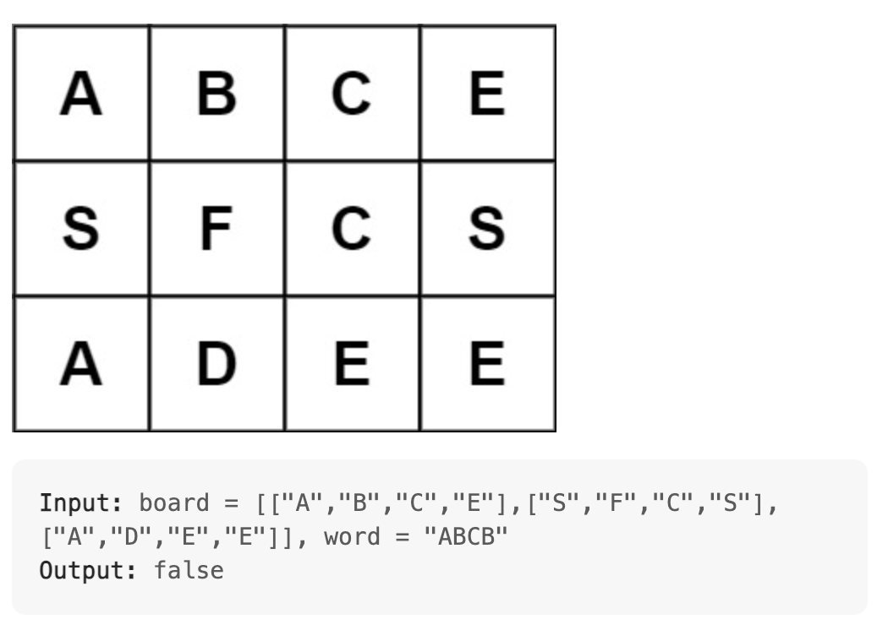

# Explanation

```
def wordFound(row, col, i):
    if (row >= ROWS or row < 0 or col >= COLS or col < 0):
        return False
    if board[row][col] != word[i] or board[row][col] == '#':
        return False
    elif i == len(word) - 1:
        return True
    
    tmp = board[row][col]
    board[row][col] = '#'
    up = wordFound(row, col + 1, i + 1)
    down = wordFound(row, col - 1, i + 1)
    left = wordFound(row - 1, col, i + 1)
    right = wordFound(row + 1, col, i + 1)
    board[row][col] = tmp
    return up or down or left or right
```
- This function is responsible for backtracking to check if a word exists in the board
- The reason for **row** and **col** being parameters is self explanatory but **i** lets us keep track at which letter we currently are in **word** 
- The reason for filling the board with '#' is because it will stop us from reusing letters twice to make up the word (example shown below)


- The rest of the code is self explanatory.
